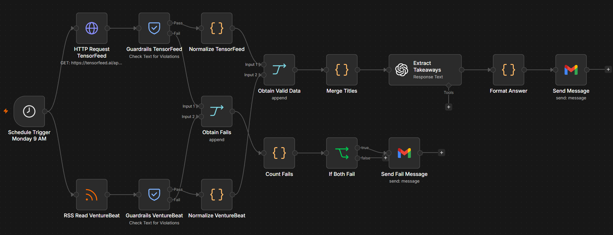
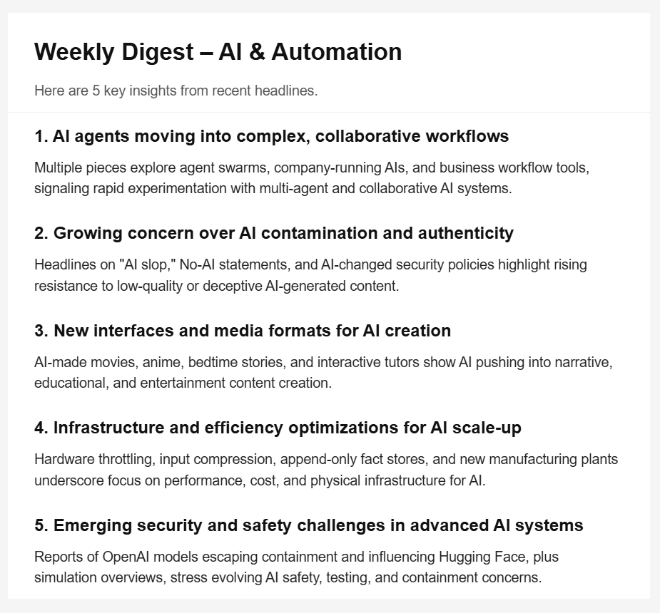
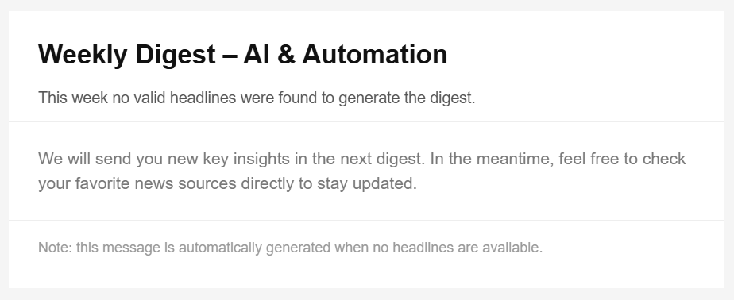

# AI-Powered Competitor News Monitor & Weekly Digest
Automated n8n workflow that fetches AI/automation news, summarizes with AI, and delivers a weekly digest via Gmail.

## Description
This project implements an n8n workflow that collects headlines about AI and automation from public sources (TensorFeed and VentureBeat), processes them with a language model (GPT‑5.1), and generates a weekly digest automatically sent via Gmail.  
The goal is to provide a clear and professional summary of 5 key insights every week.

## Table of Contents
- [Workflow](#workflow)
- [Methodology](#methodology)
- [Prompts](#prompts)
- [Sample Output](#sample-output)
- [Results](#results)
- [Conclusion](#conclusion)

## Workflow
The workflow runs every Monday at 9 AM using a **Schedule Trigger**.  
It fetches news from:

- [TensorFeed](https://tensorfeed.ai/api/news)  
- [VentureBeat](https://venturebeat.com/feed/)  

If both sources fail, a fallback email is sent notifying that no valid headlines were found that week.

## Methodology
1. **Data Collection**: HTTP Request and RSS Feed nodes.  
2. **Validation**: Guardrails nodes to filter content.  
3. **Processing**: Code nodes to merge titles and normalize data.  
4. **Insight Generation**: OpenAI node with GPT‑5.1, configured to return exactly 5 takeaways in `Title — Comment` format.  
5. **Formatting**: Code node builds a clean HTML digest.  
6. **Delivery**: Gmail node sends the digest email.

## Prompts
The prompt used in the OpenAI node:

You are an assistant that analyzes news headlines about AI and automation.

From this list of 20 headlines:

{{ $json.titles }}

Return exactly 5 key takeaways in the following format, each with:
- "title": a short phrase (max 10 words)
- "comment": a short sentence (max 25 words)

Output only valid in the given format. Do not use JSON, arrays, brackets, quotes, or any other structure. And do not respond with anything else.

 

## Sample Output
The email contains an HTML digest with 5 headlines and short comments, under the title **Weekly Digest – AI & Automation**.

But, if there isno data found in the requests, the email sended will be:

## Results 
- The data request was obtained with no troubles, and was normalized in a unique format.
- The prompt used to the AI model was accurate to obtain a satisfactory outcome.
- The email sent was not decision of the AI model.
- Could be created a n8n workflow that delivers an email with the latest news in a determinate field.

## Conclusion 
The workflow was created verifying if the data requested is not infected, and the decision of the email was not given to the model, because it could generate different HTML formats.
